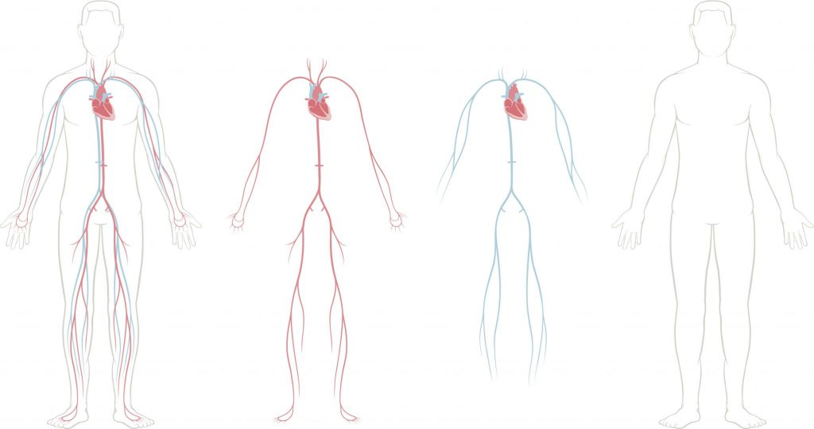
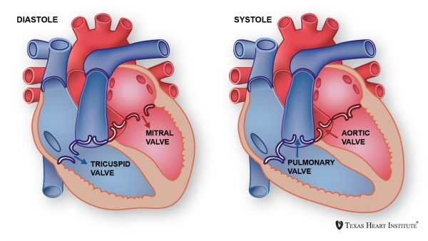

# Heart_Analysis_Detection_Project
## Introduction
- Heart disease describes a range of conditions that affect your heart. Diseases under the heart disease umbrella include blood vessel diseases, such as coronary artery disease, heart rhythm problems (arrhythmias) and heart defects you’re born with (congenital heart defects), among others.
 


- The term “heart disease” is often used interchangeably with the term “cardiovascular disease”. Cardiovascular disease generally refers to conditions that involve narrowed or blocked blood vessels that can lead to a heart attack, chest pain (angina) or stroke. 
- According to a news article, heart disease proves to be the leading cause of death for both women and men. The article states the following :
  - About 610,000 people die of heart disease in the United States every year–that’s 1 in every 4 deaths.
  - Heart disease is the leading cause of death for both men and women. More than half of the deaths due to heart disease in 2009 were in men.
  - Coronary Heart Disease(CHD) is the most common type of heart disease, killing over 370,000 people annually.
  - Every year about 735,000 Americans have a heart attack. Of these, 525,000 are a first heart attack and 210,000 happen in people who have already had a heart attack.



## Goal:
- Predict whether a patient should be diagnosed with Heart Disease. This is a binary outcome.
  - Positive (+) = 1, patient diagnosed with Heart Disease.
  - Negative (-) = 0, patient not diagnosed with Heart Disease.
 
- Experiment with various Classification Models & see which yields greatest accuracy.
- Examine trends & correlations within our data.
- Determine which features are most important to Positive/Negative Heart Disease diagnosis.

### Communication Protocols
* Slack - used for write communication 
* GoogleDrive - file sharing
* GitHub - code sharing
* Zoom - web meeting

# ETL Process
### Columns to create:
  - BMI into Obesity (Calculation based on height and weight)
    - The formula is BMI = kg/m2 where kg is a person's weight in kilograms and m2 is their height in metres squared. A BMI of 25.0 or more is overweight, while the healthy range is 18.5 to 24.9.
  - Age into Age in Years 
  - Age Ranges(for ex: ([35-39],[40-44].....[65-90])
  - Group by
  - Cholesterol levels (max, min)
  - Glucose levels (max, min)
  - Activity levels (max, min)

## Data Description:
| Feature Name | Included in Model  | Name in Data | Data type & units | Column Type |
|---------|---------|---------|---------|--------|
| Age | No | age | int (days) |
| Age in years | No | age_year | int (years)| Calculated column |
| Age Groups | No | age_group | categorical code | Calculated column |
| Age Groups Encoded | Yes: Objective Feature | age_group_encoded | 0: <40, 1: 40-49, 2: 50-59, 3: 60-89 | Encoded |
| Height | No | height | int (cm) |
| Weight | No| weight | float (kg) |
| BMI | No | bmi | int | Calculated column |
| BMI Status | No | bmi_status | categorical code | Calculated column |
| BMI Status Encoded | Yes: Objective Feature | bmi_status_encoded | 0: underweight, 1: healthy, 2: overweight, 3: obese | Encoded |
| Gender | Yes: Objective Feature | gender | categorical code |
| Systolic blood pressure | No| ap_hi | int |
| Systolic blood pressure Status | No | ap_hi_status | categorical code | Calculated column |
| Systolic blood pressure Status Encoded | Yes: Examination Feature | ap_hi_status_encoded | 0: normal, 1: elevated, 2: high_blood_pressure_1, 3: high_blood_pressure_2 | Encoded |
| Diastolic blood pressure | No| ap_lo | int |
| Diastolic blood pressure Status | No | ap_lo_status | categorical code | Calculated column |
| Diastolic blood pressure Status Encoded | Yes: Examination Feature | ap_lo_status_encoded | 0 : normal, 1: high_blood_pressure_1, 2: high_blood_pressure_2, 3: hypertensive_crisis | Encoded |
| Cholesterol | Yes: Examination Feature | cholesterol | 1: normal, 2: above normal, 3: well above normal |
| Glucose | Yes: Examination Feature | gluc | 1: normal, 2: above normal, 3: well above normal |
| Smoking | Yes: Subjective Feature | smoke | binary |
| Alcohol intake | Yes: Subjective Feature | alco | binary |
| Physical activity | Yes: Subjective Feature | active | binary |
| Presence or absence of cardiovascular disease | Target Variable | cardio | binary | 

# DASHBOARD

## Overview of the analysis

 - The purpose for this analysis is to examine the  femaleheart detection.The project is made to predict heart disease analysis using machine learning algorithms and to analysis using visualization. project implemented three machine lerning model using sklearn.
 - Only 12 feature used:
 - Active 
 - Alco
 - Ap hi
 - Aplo 
 - Bmi
 - Cardio
 - Coestrol 
 - Gender 
 - Gluc
 - Heigh 
 - Smoke
 - Weight 
 - Age


In the image "The Number Of The Testers in the Study" it shows the number of the tester in the study 68.482.
 


In the picture "The Number Of The Testers By Gender" shows the cardio status (0:Inactive, 1:Active) by Gender.The majority 44,68 female


The picture "Number Of Testers By Age Group" shows the female and male by ages count of cardio. The most notable attributes for those male 50-59 number of cardio 34,589, this indicates that for those who were male, these features were strongly presented.


The picture "Number of Testers by Ages" shows how is clear that 


The picture "Cardio Status" shows the


The picture "Systolic Blood Pressure" shows the (90 - 120) by Age Group after the 40 


The picture "Diastolik Blood Pressure 60-80 by Age Group" shows the....


## Summary

Heart diseases have become a major concern to deal with as studies show that the number of diseases due to heart diseases have increased significantly over the past few decades, in fact it has become the leading cause of death.Preventing Heart diseases has become more than necessary. Good data-driven systems for predicting heart diseases can improve the entire research and prevention process, making sure that more people can live healthy lives. This is where Machine Learning comes into play. Machine Learning helps in predicting the Heart diseases, and the predictions made are quite accurate. kaggle project


# Machine Learning
## Models tested
The targest value counts are equal to 0: 34753 and 1: 33394. The data was split into testing and training sets with random_state=1, train_size=0.7, test_size=0.3, stratify=y. 
* Balanced Random Forest Classifier
  * 
* SMOTEENN
  * 
* SMOTE Oversampling
  * 
* Easy Ensemble Classifier
  * 

## Model Trained
Two models were chosen to optimize and train: Balanced Random Forest Classifier and SMOTE Oversampling.
### Optimization of the Model
The goal for optimizing the models was to reach at least 75% accuracy. 
* General optimization occured in editing the split between the training and the testing set.
```python
# Starting split
X_train, X_test, y_train, y_test = train_test_split(X, y, random_state=1, train_size=0.7, test_size=0.3, stratify=y)
# Optimization try 1.1
X_train, X_test, y_train, y_test = train_test_split(X, y, random_state=1, train_size=0.8, test_size=0.2, stratify=y)
# Optimization try 1.2
X_train, X_test, y_train, y_test = train_test_split(X, y, random_state=1, stratify=y)
```
* Balanced Random Forest Classifier
```python
# Starting Classifier
brf_model = BalancedRandomForestClassifier(n_estimators=150, random_state=1)
# Optimization try 2.1
brf_model = BalancedRandomForestClassifier(n_estimators=175, random_state=10)
# Optimization try 2.2
brf_model = BalancedRandomForestClassifier(n_estimators=200, random_state=1)
```
* SMOTE Oversampling
```python
# Starting Resample
smote = SMOTE(random_state=1)
# Optimization try 3.1
smote = SMOTE(random_state=42)
# Optimization try 3.2
smote = SMOTE(random_state=20)
```
### Final Model Optimization Settings & Accuracy
Balanced Random Forest Classifier
 * Regaredless of the changes to the balanced random forest classifier the accuracy seems to be capped at 0.716.
 * The table below lists the top five features by importance. The feature importance did not change during the optimization.

| Percentage | Feature |
|---------|---------|
| 0.1898 | ap_hi_status_encoded_3 |
| 0.1228 | ap_lo_status_encoded_2 |
| 0.0770 | ap_hi_status_encoded_1 |
| 0.0731 | ap_hi_status_encoded_0 |
| 0.0481 | cholesterol_3 |

SMOTE Oversampling
 *  The highest accuacy for SMOTE Oversampling was 0.724 with code below. 
```python
# Optimization try 1.1
X_train, X_test, y_train, y_test = train_test_split(X, y, random_state=1, train_size=0.8, test_size=0.2, stratify=y)
# Starting Resample
smote = SMOTE(random_state=1)
```
## Machine Learning Conclusion
1. The optimization goal of 75% was not meet. The dataset appears to be maxed out at an accuracy of 0.716 for the Balanced Random Forest classifier and around 0.724 for SMOTE Oversampling. 
2. The most important feature in the accuracte prediction of cardiovascular desisease is ap_hi_status_encoded_3 which represents Systolic blood pressure in the high blood pressure status 2 range, this is the range before a hypertensive crisis also known as a heart attack. 🔗[Reference Link for blood pressure readings](https://www.healthline.com/health/high-blood-pressure-hypertension/blood-pressure-reading-explained)


